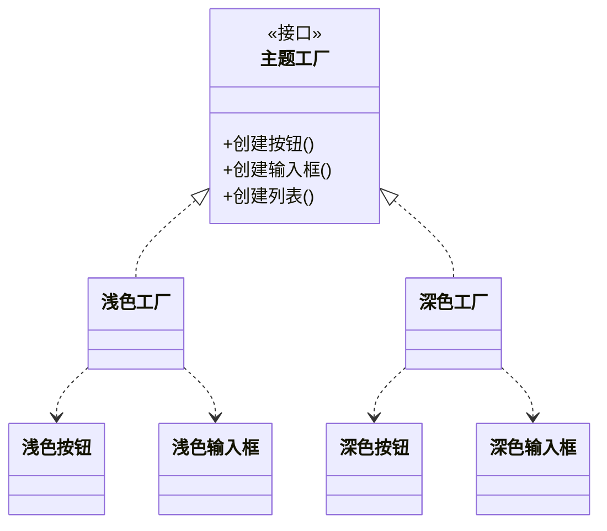

### 问题

界面要换肤——浅色主题需要浅色按钮、浅色输入框、浅色列表——它们必须配套。
散着各自创建,就会出现「深色按钮混进浅色界面」这种事故;配套关系靠人肉记住,迟早失守。

### 思路

连工厂也抽象——定义「套件工厂」接口——创建按钮、创建输入框、创建列表;每套主题一个具体工厂。
使用方拿到哪套工厂,产出的就必然全套配套。

### 结构



### 代码

```python
class LightFactory:              # 一套主题一个工厂
    def button(self): return LightButton()
    def input(self):  return LightInput()

class DarkFactory:
    def button(self): return DarkButton()
    def input(self):  return DarkInput()

def render_ui(factory):          # 使用方只认「套件工厂」接口
    factory.button()             # 拿到哪套工厂,产出必然全套配套
    factory.input()
```

### 为什么有效

配套约束从「靠人记住」变成「由类型系统保证」:整套替换只换一个工厂,不可能混用——不配套的组合在编译期就被堵死了。

### 代价

给产品族加新品种(比如多一个「开关」)要改工厂接口和所有具体工厂——这是对开闭原则的破口。
抽象工厂适合「族的种类稳定、套数多变」的场景,反过来就很难受。类的数量也会翻倍。

### 与工厂方法的区别

工厂方法管「一种产品,多个实现」;抽象工厂管「一族产品,多套主题」。
判断就看一件事——产品之间有没有必须配套的约束。

### 什么时候用

成套出现且必须配套——界面主题、跨平台控件、数据库方言(连接、命令、事务三件套)。
**反例**——产品彼此独立、没有配套约束,抽象工厂只会带来成堆的空接口。
