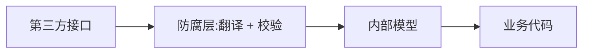

### 问题

外部系统的模型在你的系统里乱窜:第三方接口的字段名、错误码、分页方式直接漏进业务代码。
外部一改(字段偷偷变了),你的系统几十处跟着静默出错,排查像考古。

### 思路

在边界上设一道「翻译防线」:外部数据一进系统就翻译成内部模型,内部代码只见自己的模型;
外部变了,只改防线这一处。(出自领域驱动设计,直译「防腐层」。)

### 结构



### 代码

```python
def to_internal(raw):              # 防腐层:进系统即翻译
    return User(
        id=raw["user_id"],         # 字段名在这一处映射
        name=raw.get("name", ""),  # 缺字段在这一处兜底
    )

def fetch_user(uid):               # 业务代码只见内部模型
    return to_internal(third_party.get(uid))
```

### 为什么有效

外部的不确定被挡在边界:字段改名、结构调整、错误码语义,全部在翻译层一次性吸收。
内部模型按你的业务需要设计,不被外部的随意牵着走。

### 代价

多一层翻译代码,小项目嫌重;翻译层要忍住不写业务逻辑——它只翻译,不加工;
和适配器一样,塞了逻辑就变成新的泥球。

### 与适配器的关系

防腐层是「系统集成语境下的适配器加强版」:适配器管接口形状的翻译,防腐层还要管模型语义的防腐,
通常再配上模式校验,不合法的数据当场拒绝,而不是漏进去烂在深处。

### 什么时候用

对接任何外部系统:第三方接口、遗留系统、甚至上游团队的接口。
**反例**——两个模块都在你手里且演进同步,防腐层是多余的翻译。
