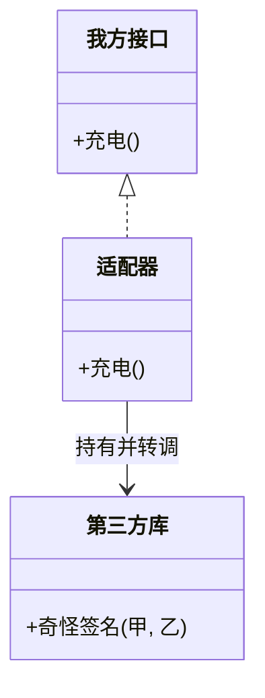

### 问题

系统要用一个第三方库,但它的接口形状和我们期望的不一样——参数顺序不同、返回结构不同、名字也不同。
双方都改不了:一边是第三方,一边是已经在跑的大片自家代码。

### 思路

加一层翻译:写一个适配器,实现我方期望的接口,内部持有并转调第三方,参数和返回值都翻译一遍。
电源转接头:美标插头插国标插座。

### 结构



### 代码

```python
class ChargerAdapter:                  # 适配器:实现我方接口
    def __init__(self, adaptee):
        self._a = adaptee              # 持有第三方

    def charge(self):                  # 我方期望的方法名
        r = self._a.weird_charge(220, "CN")  # 翻译成对方的签名
        return r["ok"]                 # 返回值再翻译回来
```

### 为什么有效

变化被隔离在适配器这一个类里:第三方升级、换库,只改它。
我方代码只依赖自己的接口,编译期感知不到第三方的存在。

### 代价

多一层转发,直白的调用变绕。
适配器一旦顺手塞业务逻辑,翻译层就成了新的泥球——只翻译,不加工。

### 与代理 / 装饰器 / 桥接的区别

四个都是「包一层」。先看接口:接口不同——适配器(翻译)或桥接(拆维度);接口相同——代理(控制访问)或装饰器(叠加行为)。
再看意图:适配器为了「能用」,代理为了「管住」,装饰器为了「加料」,桥接为了「两边各自变」。

### 什么时候用

接口不兼容且双方改不了:第三方库、遗留系统、框架接口。
**反例**——接口你自己说了算,直接改接口,别加层。
