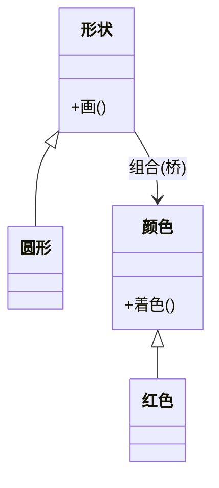

### 问题

一个类族有两个变化维度:形状(圆、方)× 颜色(红、蓝)。
用继承穷举组合:红色圆形、蓝色圆形、红色方形……维度一多,子类数量爆炸;再加一个维度(粗细),就是乘法灾难。

### 思路

两个维度各自抽象成一棵树,用组合而不是继承连接:形状持有颜色的引用。
加一种形状只加一个类,加一种颜色也只加一个类——乘积变加和。

### 结构



### 代码

```python
class Shape:                       # 抽象维
    def __init__(self, color):
        self.color = color         # 桥:组合而非继承

class Circle(Shape):
    def draw(self):
        return f"圆形 · {self.color.paint()}"

# 圆形、方形 × 红色、蓝色:4 个组合,只要 4 个类(2+2),而不是 4 个子类
c = Circle(Red())
```

### 为什么有效

每个维度独立变化:加形状不动颜色,加颜色不动形状。
这是「组合优于继承」的教科书案例——变化维度被拆开,各自长各自的。

### 代价

两层抽象带来理解成本;只有一个变化维度时纯属过度设计。
桥接要在设计早期做,它是结构性的——事后改比事前拆贵得多。

### 与适配器的区别

结构相似(都包一层不同接口),意图相反:
适配器是事后补救——让两个已有的、改不了的接口一起工作;桥接是事前设计——预料到两个维度都要变,主动拆开。

### 什么时候用

类族有多个独立变化维度:形状 × 颜色、界面 × 平台、消息类型 × 发送渠道。
**反例**——只有一个维度在变,老老实实继承或用策略。
