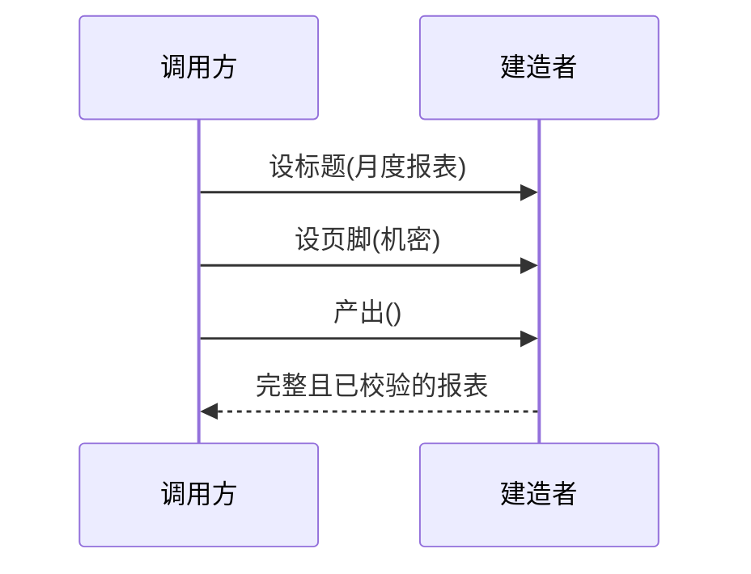

### 问题

对象的参数十几个、大多可选。构造函数的灾难形态——

```text
new 订单(客户, 地址, null, null, true, null, "元", 0)
```

调用方数参数数到瞎;想只设第四个可选参数,被迫把前三个也填上占位值。
这就是「伸缩构造函数」反模式(Effective Java 第 2 条)。

### 思路

把构造拆成有名字的步骤——先拿一个建造者,链式地设——设标题、设页脚、设水印;最后一步「产出」统一校验、一次成型。
半成品对象全程不外泄。

### 时序



### 为什么有效

参数有名字——设标题(「你好」)比第五个位置的 null 清楚一百倍;必填与可选分明;校验集中在产出那一刻;产出的对象可以做成不可变的。
加新字段 = 加一个新方法,老调用一行不用改。

### 代价

要多写一个建造者类,样板代码接近翻倍;简单对象用它是杀鸡用牛刀。
语言自带命名参数或对象字面量时(Python、Kotlin、TypeScript),建造者的收益大打折扣。

### 与工厂的区别

工厂回答「创建哪个实现」,建造者回答「一个复杂对象怎么一步步装起来」。
两者可以叠加——工厂给出建造者,建造者装出产品。

### 什么时候用

参数多、含可选、有构造顺序或产出前需要校验。
**反例**——两三个参数的平凡对象,直接构造;有命名参数的语言里,先试试语言特性再说。
