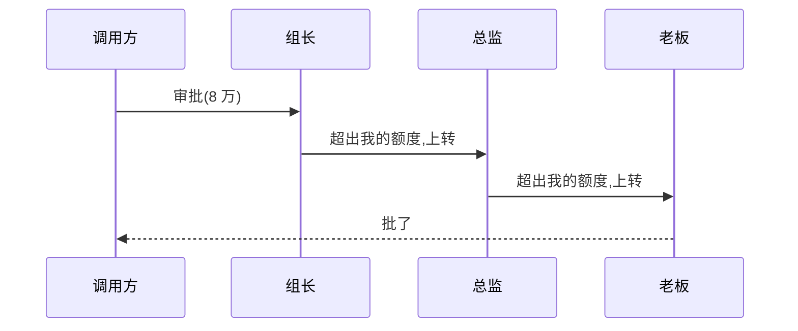

### 问题

一个请求「谁能处理」不是固定的:审批按金额逐级上报、日志按级别逐级过滤、事件按类型找处理器。
写死调用链,加一级改一处;调用方还得知道整条链上每个人都有谁。

### 思路

把处理者连成链:请求从链头进入,每个处理者要么处理、要么传给下一个,直到有人认领。
发送方只管把请求丢进链,不关心谁接住。

### 时序



### 代码

```python
class Approver:
    def __init__(self, limit, next=None):
        self.limit, self.next = limit, next
    def handle(self, amount):
        if amount <= self.limit:      # 能处理就处理
            return f"{self.__class__.__name__} 批准"
        if self.next:                 # 不能就传给下一个
            return self.next.handle(amount)
        return "没人能批"

chain = Approver(1, Approver(5, Approver(100)))  # 组长→总监→老板
```

### 为什么有效

「谁能处理」从编译期的调用代码变成运行期的链结构:加一级 = 链上插一节,发送方不动。
职责的分配变成了数据(链的顺序),不再是代码。

### 代价

请求可能传遍全链没人接(要有兜底);链的顺序即语义,配错顺序结果就错;
链长了性能逐节点衰减,且调试时追踪路径靠打断点。

### 与中间件的区别

责任链的任一节点可以**终止传递**(处理了就结束);中间件(洋葱模型)每层都必须过一遍,且请求前后都能插手。
「找一个认领者」用责任链,「层层都要加工」用中间件。

### 什么时候用

谁能处理不固定、可分级、可动态调整:审批流、日志级别、事件冒泡。
**反例**——处理者固定唯一,直接调用它。
