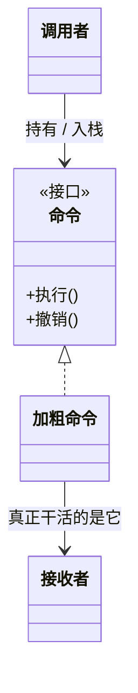

### 问题

方法调用是瞬间动作:说完就没了。想让一次操作能被存起来、排队、延迟执行、撤销、记录日志——裸的方法调用一个都做不到。

### 思路

把请求封装成对象:命令对象带着「做什么」(执行/撤销两个方法)和「需要什么」(最小上下文)。
调用变成数据——可入栈、可入队、可回放。

### 结构



### 代码

```python
class BoldCommand:                 # 命令:执行 / 撤销成对
    def __init__(self, doc, rng):
        self.doc, self.rng = doc, rng
    def execute(self): self.doc.bold(self.rng, True)
    def undo(self):    self.doc.bold(self.rng, False)

history = []
history.append(BoldCommand(doc, r)); history[-1].execute()
history.pop().undo()                 # 撤销 = 弹出最后一个命令,调它的 undo
```

### 为什么有效

操作从「调用」变成「对象」,第一次可以被存储、排队、记日志、撤销。
撤销是增量的逆操作(只记怎么倒回去),比备忘录的整页快照省内存。

### 代价

每种操作一个命令类,小功能也要建类;执行和撤销必须严格成对,撤销写错比没有撤销更糟;
宏命令(命令组合)要自己维护顺序。

### 与备忘录的区别

都能做撤销,思路相反:命令记「怎么倒回去」(增量逆操作,省内存但每步要写对);
备忘录存「当时的整份状态」(省心但占内存)。操作小且频繁用命令,状态大但恢复快用备忘录。

### 什么时候用

撤销/重做、任务队列、操作日志、宏命令、延迟执行。
**反例**——操作不需要留痕也不需要撤销,直接调用就好。
