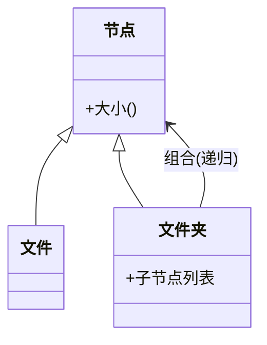

### 问题

系统里有「个体」也有「个体的组合」,组合还能再组合:文件和文件夹、按钮和面板、零件和组装件。
客户端被迫写两套代码——处理个体一遍,处理组合又一遍,还得不停判断「它到底是个体还是组合」。

### 思路

让组合和个体实现同一个接口:文件夹和文件都是「节点」,都能求大小、都能被遍历。
客户端无差别对待,递归自然发生。

### 结构



### 代码

```python
class File(Node):
    def size(self):
        return self.bytes

class Folder(Node):                    # 组合和个体同一个接口
    def __init__(self):
        self.children = []
    def size(self):                    # 客户端不区分个体 / 组合
        return sum(c.size() for c in self.children)   # 递归自然发生
```

### 为什么有效

「部分-整体」的层次被统一了:对树做任何操作(求大小、渲染、校验),写一遍递归就同时适用于叶子和枝干。
加新的节点类型,操作代码不用动。

### 代价

统一接口意味着个体类被迫带着对它无意义的方法(文件不需要「子节点列表」),接口变胖;
层级太深时递归有栈深度和性能问题。

### 与装饰器的区别

组合是把多个同类对象组织成树——目的是「整体当作个体用」;装饰器是给一个对象层层加料——目的是「增强」。
组合的容器持有一组孩子,装饰器的包装只持有一个被包装者。

### 什么时候用

树形结构,且客户端希望对个体和组合一视同仁。
**反例**——只有固定的两层结构、不会递归,直接写两层循环更简单。
