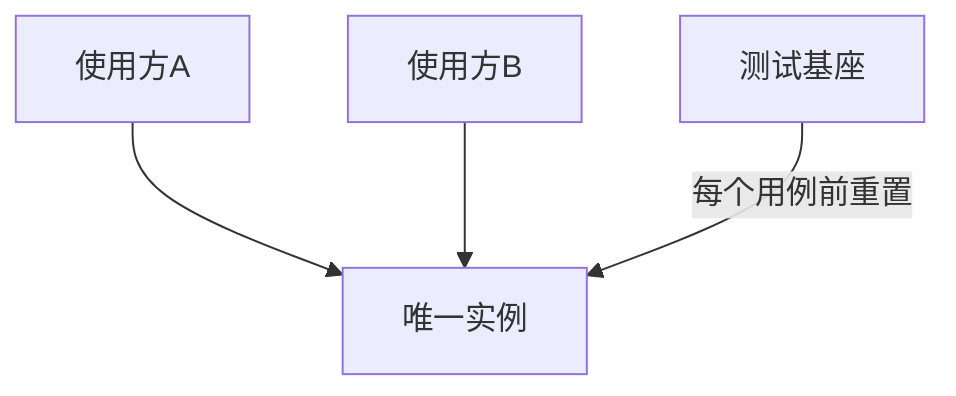

### 问题

单例的便利是真便利——任何地方伸手就能拿到。代价也是真代价——签名里看不出依赖(隐式依赖),测试之间共享状态互相污染,想换成模拟实现无从下手。
全局可访问 + 全局可修改 = 人人可依赖,架构慢慢变成蛛网。单例是 23 个模式里名声最差的,不是没用,是被滥用得最狠。

### 思路

保留「全局唯一」的便利,把控制权收回来:集中在一处创建;暴露重置口,测试前归零;能传参的地方就不走全局。
单例是妥协,不是默认。

### 结构

### 为什么有效

单例真正的价值只有「全局可及」;受控的价值是「可替换、可重置」。
创建收口 + 重置口,测试彼此隔离;显式注入优先,依赖关系看得见摸得着。

### 代价

受控也是单例——隐式依赖的风险仍在,只是有了泄压阀。
别把单例当全局变量筐——只有只读配置、日志器这种真全局设施才配;业务状态、可能需要多实例的东西,一律走依赖注入。

### 与依赖注入的关系

依赖注入是默认答案——依赖从构造函数传入,测试传模拟实现,依赖关系全写在签名上。
受控单例是例外——入口极深、逐层传递的代价比全局污染的风险还高时才用,且必须留重置口。

### 什么时候用

真正全局唯一、无状态差异的设施:只读配置、日志器。
**反例**——任何「测试里想换成假的」的依赖,都不该是单例。
