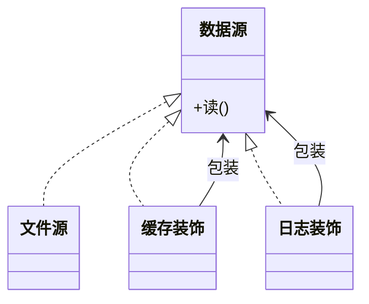

### 问题

要给对象加行为——加日志、加缓存、加鉴权——而且这些加料是可选的、可叠加的、运行期才定的。
用继承穷举:日志类、缓存类、日志加缓存类……每种组合一个子类,又是组合爆炸。

### 思路

把加料做成「包装」:装饰器和被装饰者实现同一接口,装饰器持有一个被装饰者,在转发调用的前后加自己的行为。
料一层层裹上去,原对象不动。

### 结构



### 代码

```python
class Logged(DataSource):            # 装饰器:同接口,包一层
    def __init__(self, inner):
        self._inner = inner
    def read(self):
        log("读前")                  # 加料:前
        r = self._inner.read()       # 转发
        log("读后")                  # 加料:后
        return r

source = Logged(Cached(FileSource()))  # 一层层裹,顺序即语义
```

### 为什么有效

加料从「编译期的类组合爆炸」变成「运行期的对象嵌套」:每种料一个类,裹几层、什么顺序,使用方现场决定。
原类和料类互不修改,各自独立演化。Python 的 @ 语法糖就是这个模式。

### 代价

长包装链调试不直观——调用栈里一串同名方法;顺序敏感(先缓存还是先日志,结果不同);料之间不该有隐式依赖。

### 与代理的区别

同结构,不同意图:代理是「控制」——决定让不让你访问(权限、惰性加载、缓存拦截);装饰器是「增强」——放行但加点东西。
代理通常知道自己代理谁,装饰器只认接口、任意叠。

### 什么时候用

行为可选、可叠加、运行期定:输入输出流的压缩加密缓冲、Web 框架的包装。
**反例**——加料固定且只有一两种,直接写进类里或一个代理就够。
