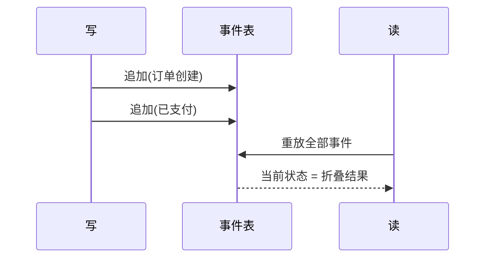

### 问题

系统只存当前状态:订单现在是「已支付」——它什么时候付的?之前是什么?谁改的?全没了。
要审计、要回放、要排查「怎么变成这样的」,数据库里只剩一个无法回答任何问题的现值。

### 思路

不存状态,存事件:每次变更追加一条不可改的事件记录(创建、支付、发货);
当前状态 = 把所有事件按序重放一遍。历史成为一等公民。

### 结构



### 代码

```python
def current(order_id):             # 现状 = 事件重放
    state = None
    for e in events.of(order_id):  # 按序折叠
        state = apply(state, e)
    return state

def pay(order_id, ts):             # 写:只追加,不改历史
    events.append(order_id, "已支付", ts)
```

### 为什么有效

过去发生的事不再丢失:审计是天然的(事件表就是账),回放可重建任意时刻的状态,排查可以「倒带」;
事件还能喂给多个读模型,写和读各自优化。

### 代价

心智负担重:现状不在表里,要算;事件结构演化(加字段)要兼容旧事件;重放的成本随事件数增长,要靠快照(备忘录)截断。
它只是存历史的一种方式,不是所有表都该换。

### 与活动日志的区别

活动日志是「记下来给人看」——辅助审计,现状仍单独存;
事件溯源是「历史即数据」——现状由事件推出,事件是唯一事实来源。
要审计加日志;要回放、要多读模型、要完整重建能力,上事件溯源。

### 什么时候用

审计要求高、需要回放重建、读写模型差异大(账务、协作编辑)。
**反例**——普通业务增删改查,只关心现值,事件溯源是给自己加戏。
