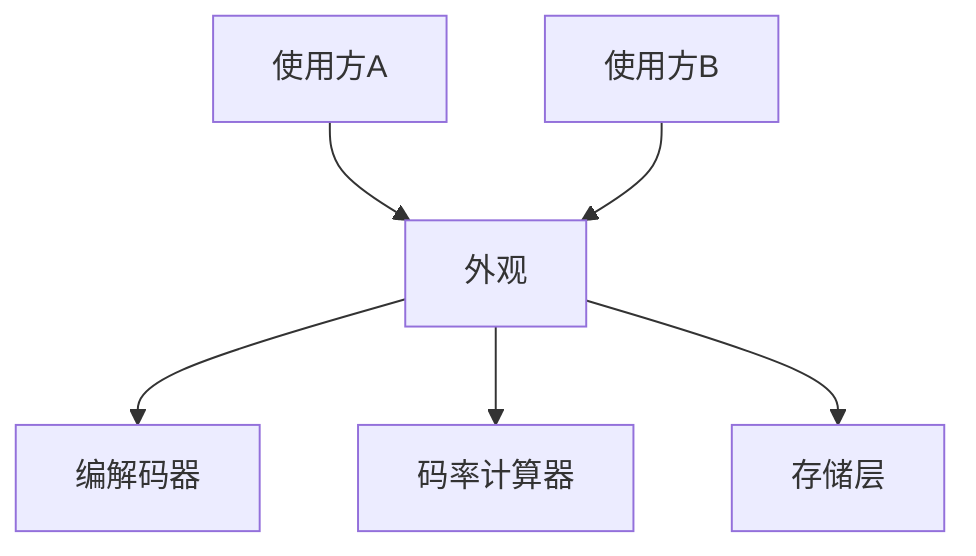

### 问题

子系统能力强大但接口繁杂:完成一次视频转码要按顺序调五六个类的十几个方法,顺序错了就崩。
每个使用方都要学一遍子系统的内部知识——学错一次出一个事故。

### 思路

给子系统设一个「前台」:一个外观类,把常用流程封装成几个简单方法。
使用方只跟前台打交道;子系统的能力没少,复杂度被藏在门后。

### 结构



### 代码

```python
class VideoConverter:                # 外观:十几个调用收成一句话
    def convert(self, file, fmt):
        codec = pick_codec(fmt)      # 子系统细节
        rate = bitrate(file, codec)  # 使用方不用知道
        raw = storage.read(file)
        return storage.save(codec.encode(raw, rate))

# 使用方:converter.convert("片子.mp4", "webm") —— 完事
```

### 为什么有效

外观不是封装全部,而是给「常用路径」修一条直路:复杂度仍在,只在需要时才面对。
它降低的是学习成本和出错率——子系统的知识从「人人必修」变成「读外观注释即可」。

### 代价

外观容易长成「上帝对象」:什么都往里堆,最后它自己成了子系统。
守住边界——外观只做编排转发,不写业务逻辑;非常用路径允许绕过外观直接用子系统。

### 与适配器的区别

适配器是「翻译」——把一个类的接口换成客户期望的形状;外观是「简化」——把一组复杂接口收成几个易用的。
适配器让一个类能用,外观让一个子系统好学。

### 什么时候用

子系统接口繁杂、使用方多、调用有固定套路。
**反例**——子系统本来就简单,外观只是多一层转发,反而稀释语义。
