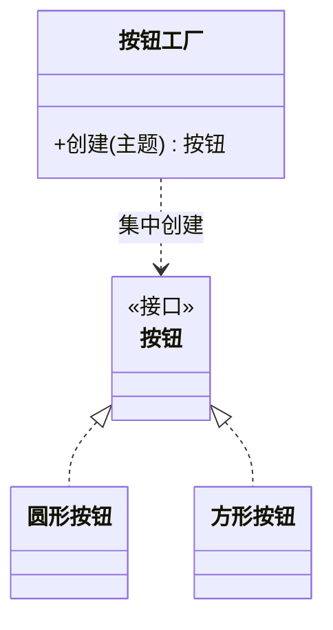

### 问题

使用方代码里到处是 new 具体类:new 圆形按钮、new 方形按钮……换实现时要全局搜 new,漏改一处就是事故;创建逻辑(参数、默认值)散落在每个使用点,改起来要改一片。

### 思路

把「创建哪个实现」的决策从使用方剥离,收进一个工厂方法。使用方只说「我要一个按钮」,拿到的是接口;谁来 new、new 哪个类,全部集中在工厂里。

### 结构



### 代码

```python
def create_button(theme):        # 工厂:创建决策集中在这一处
    if theme == "light":
        return RoundButton()     # 换实现只改这里
    return SquareButton()

class Panel:                     # 使用方:只见接口,不见具体类
    def __init__(self, theme):
        self.button = create_button(theme)   # 不再出现 new RoundButton()
```

### 为什么有效

创建点从「散布在多处」收成「单点」——换实现只改工厂一处。使用方依赖抽象接口,编译期不再绑死具体类,这正是创建耦合的解药。

### 代价

多一层间接,代码量略增;如果每种产品都要配一个工厂子类,类的数量会翻倍。
实现永远只有一个、构造又简单的对象,直接 new 就好,别为仪式感建工厂。

### 与抽象工厂的区别

工厂方法每次创建一个产品(一种按钮);抽象工厂创建一整套配套产品(按钮 + 输入框 + 列表,同一主题)。
单个产品用工厂方法,成族配套才上抽象工厂。

### 什么时候用

换实现要全局搜 new;创建逻辑复杂或会变化。
**反例**——对象只有一种实现且构造平凡,工厂是多余的间接层。
