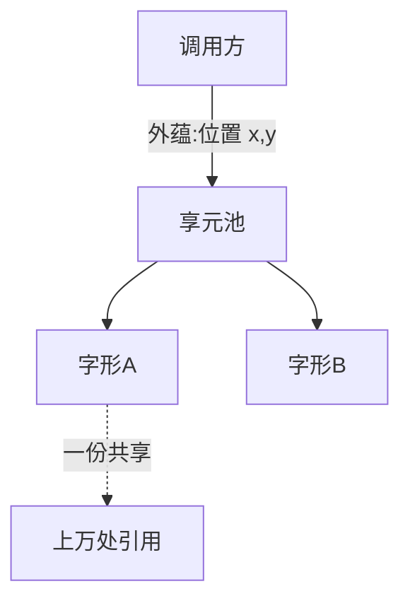

### 问题

海量细粒度对象拖垮内存:编辑器里每个字符一个对象、棋盘上每个棋子一个对象、地图上每棵树一个对象——
十万个对象,大部分字段一模一样,内存全是重复。

### 思路

把状态拆成两半:**内蕴状态**(大家一样的部分:字符的字形、棋子的图片)共享一份,存在池子里;
**外蕴状态**(位置、颜色)由调用方传入。对象数量从十万降到「种类数」。

### 结构



### 代码

```python
class GlyphPool:                     # 享元池:内蕴状态只存一份
    _pool = {}
    @classmethod
    def glyph(cls, font, size):
        key = (font, size)
        if key not in cls._pool:
            cls._pool[key] = Glyph(font, size)   # 贵,只建一次
        return cls._pool[key]

def draw(ch, x, y):                  # 外蕴状态(位置)调用时传入
    GlyphPool.glyph(ch.font, ch.size).render(x, y)
```

### 为什么有效

内存占用从「对象数 × 全量字段」降到「种类数 × 内蕴字段 + 对象数 × 外蕴引用」。
Java 的字符串池、小整数缓存就是这个模式。

### 代价

内外拆分是手工活——拆错了(把可变状态当内蕴共享)就是全局污染;
享元让对象「没有身份」,相等性判断要小心;池子本身也要管理(并发、淘汰)。

### 与单例的区别

单例是「全系统一个」,享元是「每种一个」——池里可以有几百个享元。
单例管数量为一,享元管数量为种类数。

### 什么时候用

对象数量巨大、大部分是重复状态、且能拆出稳定的内蕴部分。
**反例**——对象本来就少,或每个对象状态都独特,池子只会增加复杂度。
