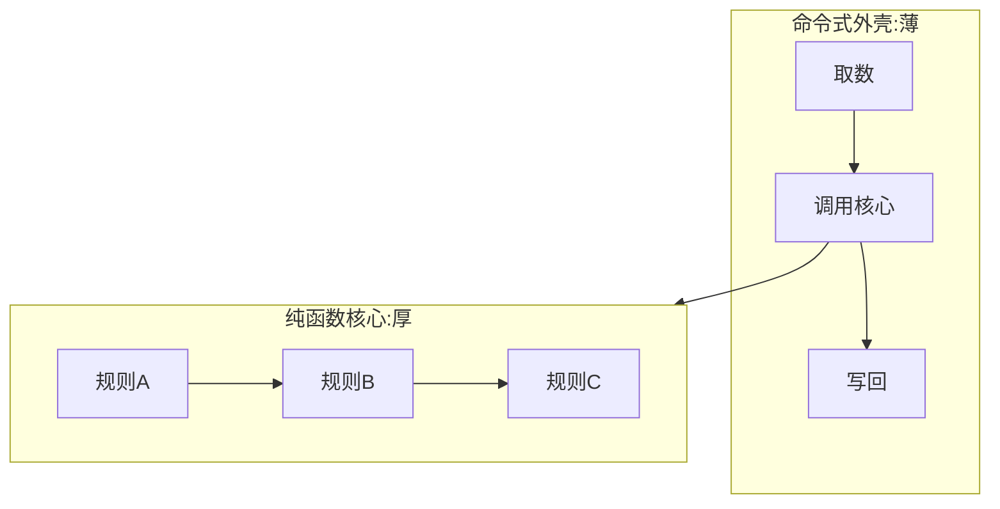

### 问题

业务逻辑和输入输出缠在一起:算价规则里直接读库、发请求、取当前时间——
想单测一个规则,得先架数据库、起网络、调时钟。测试写不动,逻辑不敢改。

### 思路

把系统分成「纯函数核心」和「命令式外壳」:
核心只进数据出数据,不碰任何外部世界;外壳薄,只做取数、调用核心、把结果写回去。
(出自 Gary Bernhardt 的「函数式核心,命令式外壳」。)

### 结构



### 代码

```python
# 核心:进数据出数据,不 import 任何输入输出库
def price(order, rules, now):      # 连时间都当参数传进来
    return sum(rule(order) for rule in rules)

# 外壳:取数 → 调用 → 写回,薄到不需要测
def handler(req):
    order = db.get(req.id)                     # 外壳碰数据库
    result = price(order, rules, datetime.now())  # 核心纯计算
    db.save(result)                            # 外壳写回
```

### 为什么有效

纯函数不需要模拟任何东西就能测——给输入、断言输出,完事。
可测性不是测出来的,是拆出来的:核心里出现一个取当前时间或发请求,就是边界漏了。

### 代价

所有外部依赖都要参数化传入,核心的函数签名会变长(用上下文对象收敛);
完全不碰输入输出的纯系统是幻觉——目标是外壳尽量薄,不是外壳消失。

### 与分层的关系

纯函数核心 ≈ 领域层的极端形态:不但下层不知道上层,核心连「外部世界存在」都不知道。
分层管目录结构,函数式核心管函数内部——两者正交,叠加使用。

### 什么时候用

业务规则复杂、测试价值高(算价、校验、编排)。
**反例**——增删改查为主的接口皮,核心薄到没有,直接用外壳写完事。
