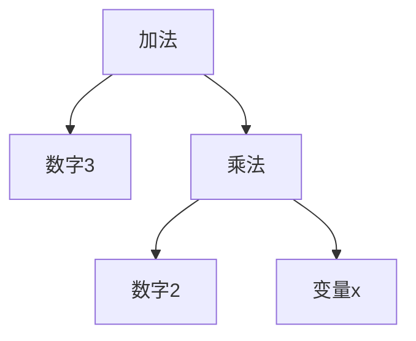

### 问题

程序里有一块「小语言」:规则表达式、搜索语法、简单的配置脚本——需要解析并执行。
为它引入完整的解析器工具太重,手写一串字符串判断又乱又脆。

### 思路

把语言的每条文法规则做成一个类,组合成语法树,递归求值。
加法表达式 = 左子树 + 右子树,叶子是数字——每个类都会「解释自己」。

### 结构



### 代码

```python
class Num:
    def __init__(self, v): self.v = v
    def eval(self): return self.v          # 叶子:解释自己

class Add:
    def __init__(self, l, r): self.l, self.r = l, r
    def eval(self):                        # 递归:组合解释
        return self.l.eval() + self.r.eval()

expr = Add(Num(1), Add(Num(2), Num(3)))    # 1+(2+3)
expr.eval()                                # 6
```

### 为什么有效

文法规则显式化成类:加一条语法规则 = 加一个类,解析和求值的结构清晰可见,不用在一堆字符串分支里考古。

### 代价

每条规则一个类,语言一大类就爆炸;性能不如专门的解析器。
**它只适合小型语言**——语法复杂就上解析器生成器(ANTLR、Lark),别硬扛。

### 与访问者的关系

解释器让每条文法类「解释自己」(操作写死在类里);语法树稳定后想加操作(美化打印、静态检查),配访问者——
两者是语法树场景的经典搭档。

### 什么时候用

小型、稳定、求值直观的语言:规则引擎表达式、过滤器语法。
**反例**——语言复杂或演化快,直接上解析器工具。
