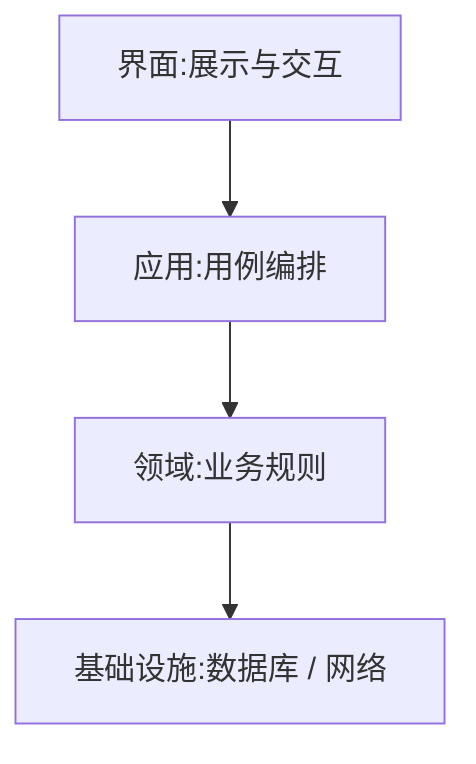

### 问题

项目长大之后,界面代码里写着写着冒出一句直查数据库,业务规则里藏着一页弹窗逻辑——
所有东西互相认识,改一处,崩一片;想单独测业务规则,得先把界面和数据库都架起来。

### 思路

按变化频率把系统切成层:界面变得最快,业务规则最稳,基础设施最慢。
依赖只许自上而下——上层可以知道下层,下层不知道上层的存在。

### 结构



### 代码

```python
# 领域层:不知道数据库、不知道界面,只有业务规则
class OrderService:
    def __init__(self, repo):      # repo 是接口,谁来实现?下层的事
        self.repo = repo
    def place(self, order):
        if order.total < 0: raise ValueError("金额非法")
        self.repo.save(order)      # 这一层没有任何 import 数据库
```

### 为什么有效

变化频率不同的东西被分开:换数据库只动基础设施层,改界面只动界面层。
各层只依赖下一层,变化不会跨层乱窜——认知负担从「整个系统」降到「相邻两层」。

### 代价

**透传层**——中间层什么都不做只顾转发,等于没分,还多一层文件跳转;
**下层偷调上层**——回调、事件总线滥用,方向被破坏,分层名存实亡;
层数不是越多越好,三四层是甜点区。

### 落地

用依赖边界检查(ESLint 的边界插件、依赖巡航工具)把方向固化进持续集成,保存即报错——靠自觉的分层活不过三个版本。

### 什么时候用

系统有明确的变化频率差异(界面快、规则慢、基建最慢)。
**反例**——一次性脚本、几十行的小工具,分层是给自己造迷宫。
