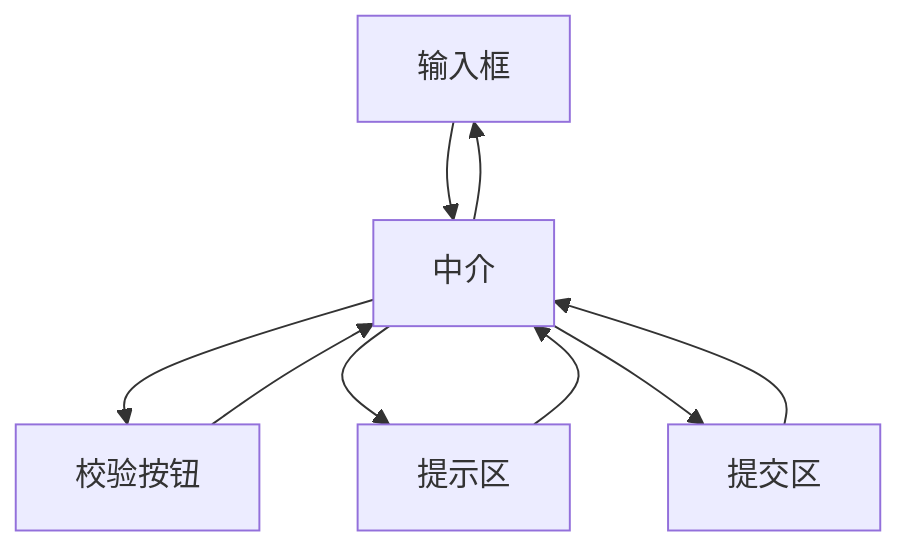

### 问题

多方互相关联:改一个输入框要联动校验按钮、提示区、提交状态……每个控件都要认识其他所有控件,
网状互调,加一个控件就要改一圈,缠成蜘蛛网。

### 思路

引入一个中介者:所有控件只跟中介说话,联动规则集中在中介一处。
网状结构收敛成星型——控件之间互不认识。

### 结构



### 代码

```python
class FormMediator:                  # 中介:联动规则集中在这里
    def on_input_changed(self):
        ok = validate(self.input.value)
        self.submit.enabled = ok     # 控件之间互不认识
        self.hint.visible = not ok

input.on_change = mediator.on_input_changed   # 控件只跟中介说话
```

### 为什么有效

交互拓扑从「多对多」变成「多对一」:联动逻辑集中在中介,改规则只改一处;
控件变成可复用的哑组件,不知道自己在哪个表单里。

### 代价

中介容易长成「上帝类」——所有联动规则堆一处,几百行后开始腐烂;要按场景拆中介,别贪一个。
交互复杂时,中介内部的规则网同样需要维护。

### 与观察者 / 发布订阅的区别

观察者是「我变了,谁关心谁听」——主题不知道听众要干什么;中介者是「我来指挥」——中介知道每个角色的职责,按规则调度。
广播出去就失控(听众各干各的)时,需要中介者;只是通知不关心后果时,观察者就够。

### 什么时候用

多方互调缠成网、联动规则集中且复杂:表单联动、对话框控件群、聊天室。
**反例**——只有两方交互,直连或观察者更简单。
