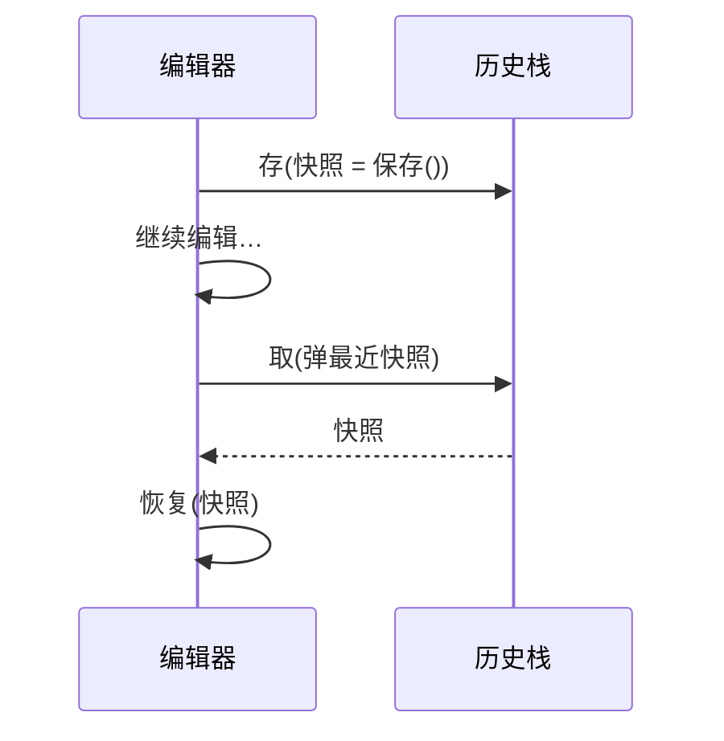

### 问题

要回滚到之前的状态:撤销一步操作、恢复一个检查点。
直接翻对象的字段?封装被破坏;字段几十个,漏存一个,恢复出来的就是残缺的。

### 思路

让对象自己产出一份「快照」(备忘录):快照由对象自己创建、自己恢复,外人只能持有,不许拆看。
封装不破,历史可回。

### 时序



### 代码

```python
class Editor:
    def save(self):                # 产出快照:外人只许持有
        return Snapshot(self.text, self.cursor)

    def restore(self, snap):       # 从快照恢复:也只有自己能拆
        self.text, self.cursor = snap.text, snap.cursor

history.append(editor.save())      # 关键时刻存一份
editor.restore(history.pop())      # 撤销 = 取最近快照恢复
```

### 为什么有效

状态的保护和回放都收在对象自己手里:字段加减,快照格式跟着对象走,历史栈不用变。
「当时那一刻」被原样封存,而不是一堆散字段。

### 代价

快照是整份状态——对象大、存得多,内存涨得快(文本编辑器每一步都存全文的教训)。
解决:增量快照、设历史上限、或改用命令模式(增量逆操作)。

### 与命令模式的区别

备忘录存「当时的整份状态」——省心、恢复快,但占内存;命令记「怎么倒回去」——省内存,但每步的撤销都要写对。
状态大但恢复快用备忘录;操作小且频繁用命令。

### 什么时候用

撤销、检查点、事务回滚点的存档。
**反例**——状态很小且操作可逆,命令模式更省。
