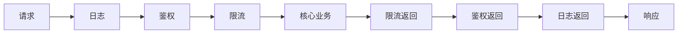

### 问题

一个请求的处理要穿越一串通用环节:日志、鉴权、限流、压缩……写进业务函数,每个函数都裹一层杂音;
分散成函数前的调用,顺序和完整性全靠人肉对齐。

### 思路

把请求处理做成管线:每个环节是一个中间件,前一个包着后一个,请求像洋葱一样层层穿透到核心,响应再层层穿回来。
加环节 = 往管线里插一节,主干不动。

### 结构



### 代码

```python
def logger(next):                  # 中间件:包了下一个,前后都能插手
    def handle(req):
        print("进")                # 前
        r = next(req)              # 穿透到下一层
        print("出")                # 后
        return r
    return handle

app = logger(auth(limit(core)))    # 组装即语义:顺序写在包裹顺序里
```

### 为什么有效

横切关注点(日志、鉴权)从业务函数里剥离,各归其位;顺序即结构——谁在前谁在后,读组装代码就一目了然。
这是「开放封闭」在请求处理上的落地。

### 代价

隐式控制流:看核心函数看不出它被谁包着,排查要在组装处看全链;
顺序敏感(先鉴权还是先限流结果不同);中间件之间不该有隐式共享状态。

### 与责任链的区别

责任链是「找一个认领者」——任一节点处理了就终止传递;中间件是「层层都要加工」——每层必经,请求前后都能插手。
审批认领用责任链,请求加工管线用中间件。

### 什么时候用

请求处理有横切环节且会增改:Web 框架、接口网关、消息处理管道。
**反例**——处理环节永远固定且只有两步,直接写两个函数调用。
