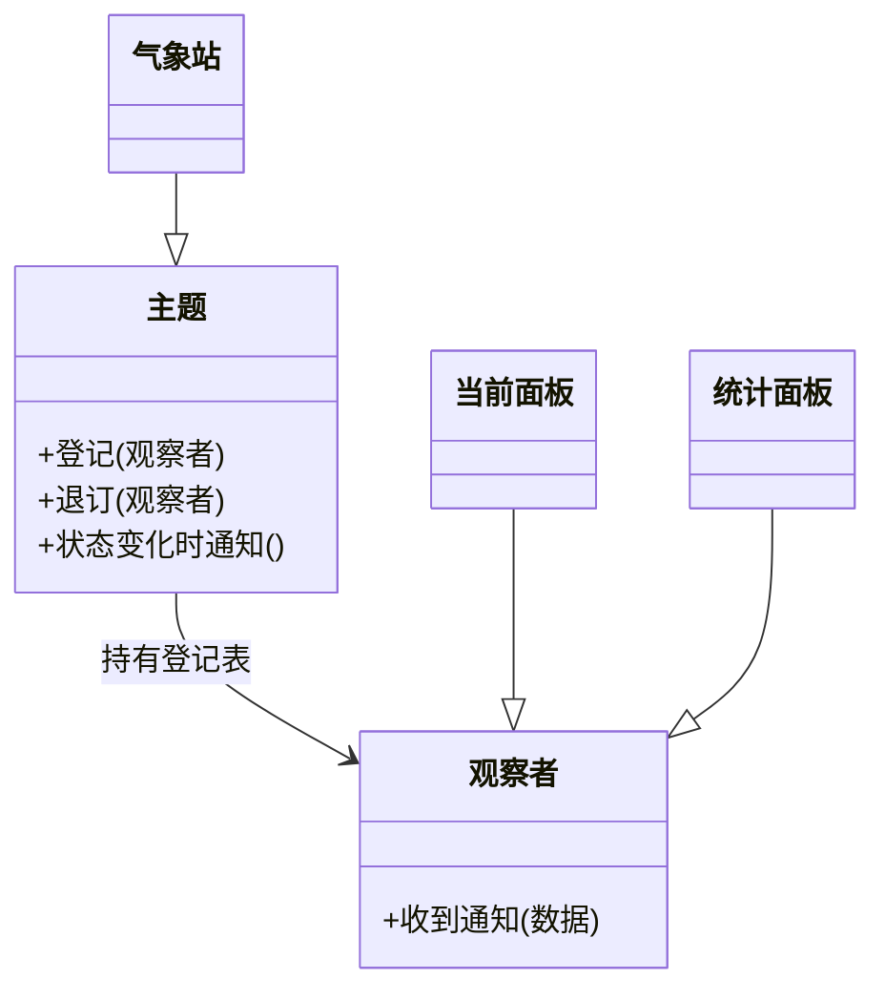
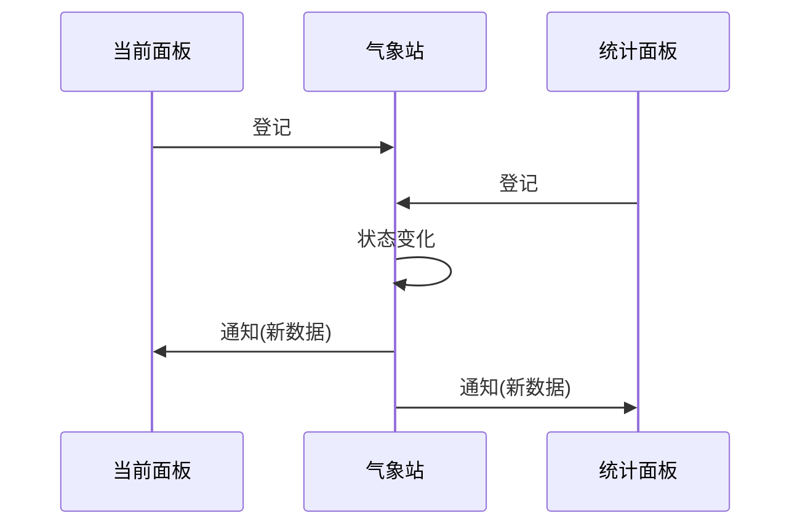

### 问题

天气变化时,界面上好几个地方都要跟着变:当前面板、统计面板、预报面板。
最直接的写法是气象站挨个调用它们——更新当前面板、更新统计面板……

问题很快暴露——每加一块面板就要改气象站的代码;气象站被迫认识所有面板,名字和类型全部写死;想在运行中动态去掉一块面板,办不到,调用是编译期写死的。

### 思路

把方向反过来——不是「我认识你,所以我通知你」,而是「你关心我,所以你来登记」。

气象站只维护一张登记表——谁登记了就通知谁,登记者长什么样它一概不管。
这张表的全部内容——一个列表,加两个方法:登记、退订。

### 结构



### 时序



### 代码

```python
class WeatherStation:                # 主题
    def __init__(self): self._subs = []
    def attach(self, o): self._subs.append(o)    # 登记
    def detach(self, o): self._subs.remove(o)    # 退订
    def changed(self, data):                     # 状态变化
        for o in self._subs:
            o.notify(data)                       # 逐个通知

class Panel:                         # 观察者
    def notify(self, data): self.redraw(data)
```

### 为什么有效

底层原理是依赖倒置——气象站依赖的是「能收通知」这个抽象约定,而不是任何具体面板。
变化点被隔离了——面板的增减不再传导到气象站。通知谁、有几个,从编译期写死的代码,变成运行期可改的数据。

### 代价

**数据流变隐式**——看气象站的代码看不出「谁会动」,排查时要全局搜登记点。
**顺序无保证**——多个观察者的通知先后,不要依赖。
**忘记退订**——观察者被登记表持有,不再使用又不退订,就会泄漏。
**通知风暴**——变化太频繁时,一次变化全员通知,开销乘以订阅数。

### 与发布订阅的区别

**观察者**——登记直接发生在主题身上,主题持有观察者列表;它仍知道「我有一群听众」,只是不认识具体是谁。
**发布订阅**——中间再隔一个事件中心,发布者和订阅者互不知晓,连「主题」这个概念都不存在。

更灵活,也更难追踪。同进程内、监听方明确,观察者就够;跨进程、跨系统,才需要发布订阅。

### 什么时候用

一变要通知多方,且监听方运行期动态增减(界面刷新、日志、联动模块)。
**反例**——监听方固定且只有一两个,直接调用更简单,别为想象力解耦。
