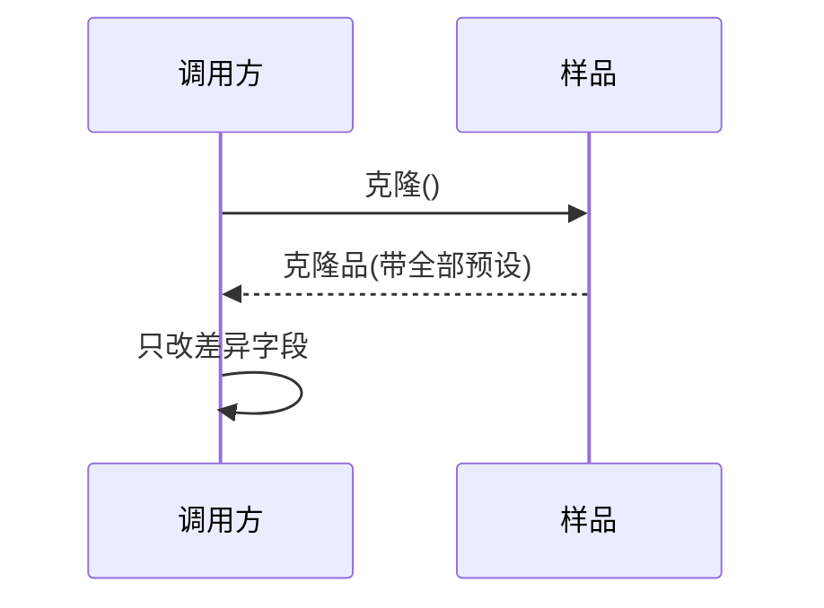

### 问题

有些对象初始化很贵——读配置、建连接、预计算,每次从头 new 都是浪费。
还有些对象配置来之不易——一份调好参数的报表模板,想再要十份,难道重调十遍?

### 思路

不构造,复制——备一个配置好的「样品」,要新对象就克隆它,拿到克隆品只改差异部分。
创建从「按图纸造」变成「按样品复印」。

### 时序



### 代码

```python
import copy

template = load_report_template()   # 昂贵的初始化只做一次

report = copy.deepcopy(template)    # 克隆:带全部预设
report.title = "9 月报表"           # 只改差异部分

# 陷阱:copy.copy 是浅拷贝——引用字段仍然共享,改了会互相污染
bad = copy.copy(template)
bad.rows.append(...)                # 连 template.rows 也变了!
```

### 为什么有效

克隆是内存级复制,绕过昂贵的初始化路径;样品本身可以携带状态,「印哪种」运行期才决定,比写死类型灵活。

### 代价

**浅拷贝陷阱**——只复制对象本身,引用字段仍指向同一对象:改克隆品的列表,样品的列表跟着变。相当于复制了快捷方式,没复制文件夹。要么深拷贝(递归复制所有引用),要么保证内部状态不可变。
**实现成本**——深拷贝遇到循环引用、资源句柄(文件、连接)很棘手;用序列化换深拷贝则性能跳水。
**破坏封装**——克隆绕过构造函数的防护,对象的不变量要靠克隆方法自己守住。

### 与工厂的区别

工厂按「类型」造对象,原型按「样品」复制对象——样品带着运行期的状态,这是工厂给不了的。
参数一模一样的多次创建用工厂;复制「某个具体配置」用原型。

### 什么时候用

初始化昂贵、配置复杂、运行期才确定类型。
**反例**——对象简单无状态,直接 new 最便宜;内部全是可变引用又不想写深拷贝时,别碰原型。
