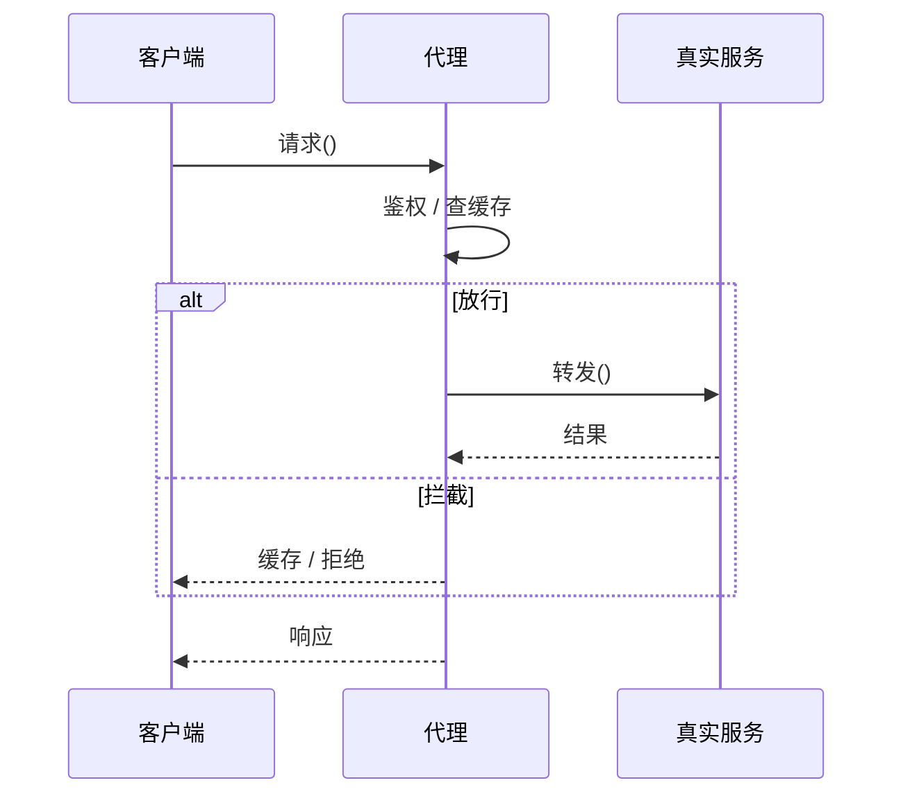

### 问题

要碰一个对象,但不能或不该直接碰:远程服务要走网络、大对象加载很慢、敏感操作要鉴权——直接调用就失控了。

### 思路

放一个「替身」在中间:代理和真实对象实现同一接口,客户端无感;
代理在转发的前后插手——缓存、校验、惰性加载、记录、拒绝。

### 时序



### 代码

```python
class ApiProxy:
    def __init__(self, real):
        self._real = real
    def get(self, key):
        if not authorized():             # 插手:前(控制)
            raise PermissionError
        if key in cache:                 # 插手:命中就不转发
            return cache[key]
        return self._real.get(key)       # 转发
```

### 为什么有效

代理是「同一接口上的关卡」:控制逻辑不污染真实对象,客户端也不需要知道关卡存在。
它是防腐层、网关、缓存层的最小结构原型。

### 代价

多一层间接;代理通常知道自己代理谁,代理种类多了也要管理;
别在代理里写业务逻辑——关卡只做关卡的事。

### 与装饰器的区别

同结构,不同意图:代理控制访问(拦不拦),装饰器增强行为(加不加料)。
代理常按具体对象建(远程代理、保护代理),装饰器按接口叠(任意组合)。

### 什么时候用

访问要过关卡:网络、权限、惰性、缓存。
**反例**——没有要拦的事,代理就是废话层。
