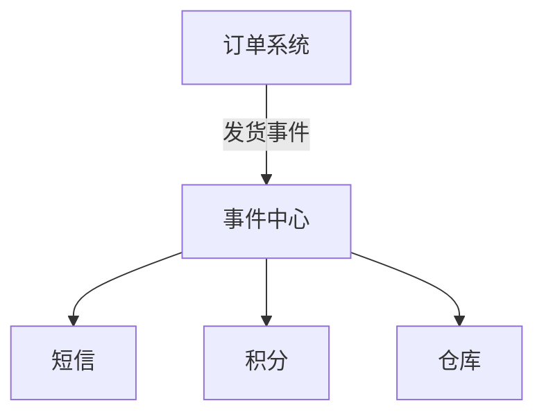

### 问题

一变要通知多方,但发布者不该知道订阅者:订单系统发货了,短信、积分、仓库、统计都要动——
让订单系统认识它们每一个,每加一方就改订单系统,耦合成网。

### 思路

中间加一层事件中心:发布者把事件丢给中心,订阅者从中心取。
双方互不知晓——发布者不知道谁在听,订阅者不知道谁在说。

### 结构



### 代码

```python
class EventBus:
    def __init__(self): self._subs = {}
    def on(self, topic, fn): self._subs.setdefault(topic, []).append(fn)
    def emit(self, topic, data):
        for fn in self._subs.get(topic, []): fn(data)

bus.on("发货", send_sms)           # 订阅者:从中心取
bus.emit("发货", order)            # 发布者:丢给中心,谁也不认识
```

### 为什么有效

拓扑彻底解耦:加订阅方不动发布方,加发布方不动订阅方;可按主题分流,只收感兴趣的事件。
跨进程时事件中心换成消息队列,结构不变。

### 代价

数据流完全隐式:谁触发了谁,要靠全局搜订阅点才能还原;事件没有顺序保证;调试链路断在中心两侧。
事件一出事,排查难度比直接调用高一个量级——这就是为什么它挂在 ⚠︎ 代价提醒里。

### 与观察者的区别

观察者:主题持有订阅者列表,主题知道「我有一群听众」,只是不认识具体是谁。
发布订阅:中间多一层事件中心,连「主题」都不存在——双方彻底匿名。
同进程、监听方明确,观察者就够;要彻底解耦或跨进程,用发布订阅。

### 什么时候用

跨模块、跨进程的事件通知,且加订阅方的频率高。
**反例**——监听方固定的一两个,直接调用或观察者更简单,别为想象力解耦。
