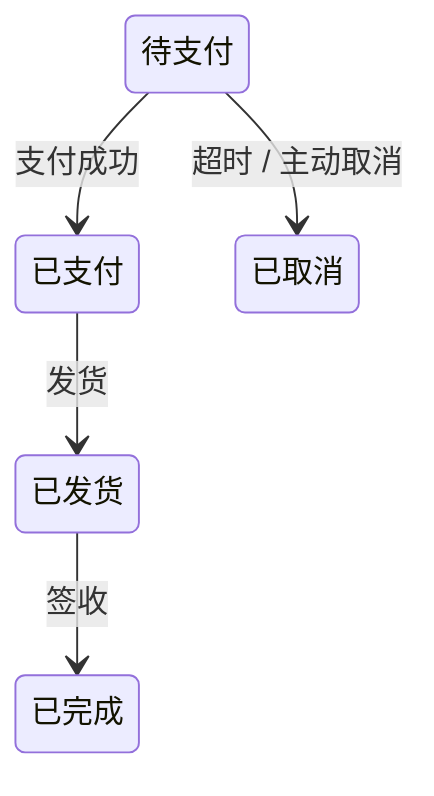

### 问题

对象的行为随状态剧变:订单在「待支付、已支付、已发货」下能做的操作完全不同;
写成 if-else 按状态分支,加状态就要动所有分支,非法流转(已发货再支付)没有东西拦。

### 思路

每种状态封装成一个类,行为写在状态类里;当前状态对象替换即切换行为,对象看上去像换了个类。
关键:状态类自己知道下一步去哪——流转规则写在状态里,不在使用方。

### 结构



### 代码

```python
class PendingPay:                  # 状态类:行为 + 流转规则都在这
    def pay(self, order):
        order.state = Paid()       # 状态自己决定下一步去哪
    def ship(self, order):
        raise ValueError("未支付不能发货")   # 非法流转直接拒绝

class Paid:
    def pay(self, order): raise ValueError("不能重复支付")
    def ship(self, order): order.state = Shipped()
```

### 为什么有效

if-else 的「按状态分支」变成「按状态换对象」:加状态 = 加一个类,老状态不动;
非法流转在状态类里显式拒绝,不会悄悄发生。

### 代价

状态多的话类数量膨胀;流转逻辑散在各状态类里,想看全图要翻一圈——配一张状态图当文档几乎是必须。

### 与策略的区别

结构一模一样,区别在**谁决定切换**:
策略由使用方主动选(我要这个算法),策略之间互不认识;状态由状态对象自己流转(做完这步自动进下一态),使用方无感知,且状态知道其他状态的存在。

### 什么时候用

行为随状态剧变、状态多、流转有规则:订单、工单、审批流、连接状态机。
**反例**——只有两三个状态且几乎不变,一个枚举加 if 就够了。
