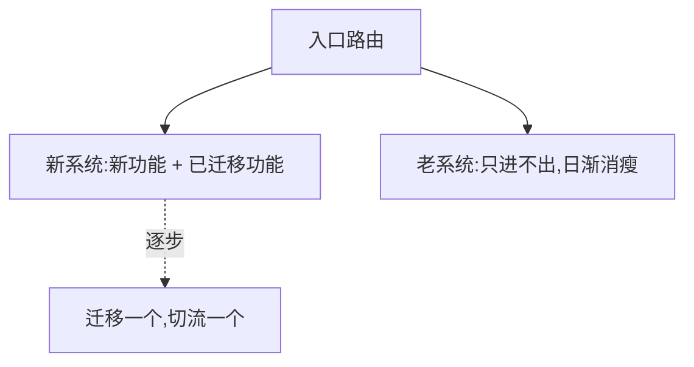

### 问题

老系统想重写:功能多、风险大、业务不能停。推倒重来?
历史上推倒重写的故事大多以「新系统没写完,老系统又落后了三年」收场。

### 思路

不重写,绞杀:新功能一律进新系统;老功能一个个迁移,迁一个切流一个;
老系统被新系统慢慢「绞杀」,直到可以拔掉。(出自马丁·福勒,以绞杀榕命名——新树围着老树长,最后取代它。)

### 结构



### 代码

```python
def route(path):                   # 路由层是唯一机关
    if path in MIGRATED:           # 迁过的走新系统
        return new_app
    return legacy_app              # 其余继续老系统
```

### 为什么有效

重写最大的风险是「大爆炸切换」:一切赌在上线那一天。绞杀者把风险摊平到每一次小迁移:
每一步都可回滚、可验证、可停下——系统全程可用,重构从项目变成日常。

### 代价

过渡期两套系统并存,路由和数据同步要维护;迁移到 80% 就烂尾是最常见的死法——
要有「迁完才许加新花样」的纪律,否则永远并存。

### 与重写的区别

重写是「换一个」,绞杀是「长一个」:前者赌一次性切换,后者赌渐进渗透。
团队对老系统理解越深、业务越不能停,越该选绞杀。

### 什么时候用

老系统还能跑、业务不能停、没人完整理解老系统。
**反例**——老系统小且理解充分,直接重写更快。
