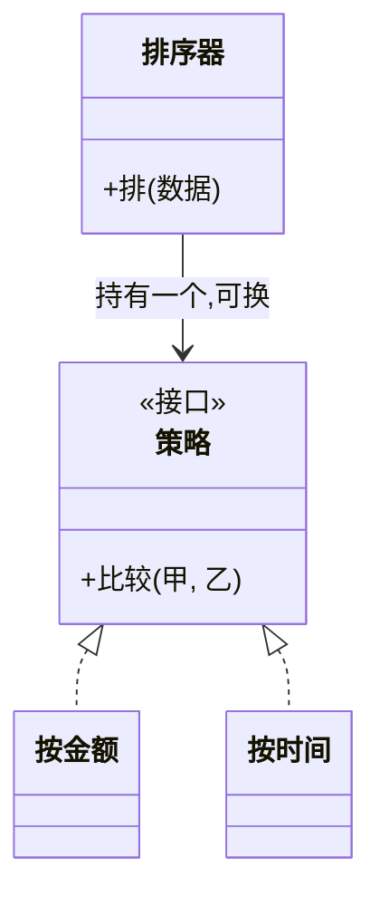

### 问题

同一个计算有多种算法:排序按金额、按时间、按优先级;促销按满减、按折扣、按会员价。
写成一串 if-else,每加一种算法就要改老代码,分支越接越长,测试越来越难。

### 思路

每种算法封装成同接口的实现,使用方持有一个策略接口,运行期按场景选用哪个。
算法的变化与使用算法的代码分家。

### 结构



### 代码

```python
class Sorter:
    def __init__(self, strategy):      # 注入策略,运行期可换
        self.strategy = strategy
    def sort(self, data):
        return sorted(data, key=self.strategy.key)

Sorter(ByAmount()).sort(orders)        # 选哪个算法是用方现场决定的
Sorter(ByTime()).sort(orders)
```

### 为什么有效

if-else 的「条件 → 分支」变成「接口 → 实现」:加算法 = 加一个类,使用方不动。
每种算法独立可测,变化点被精确隔离。

### 代价

每种算法一个类,简单场景类数量膨胀;策略之间不应共享隐式状态。
Python 里函数就是一等公民,很多场合一个函数参数就够了,不必非得建类。

### 与状态模式的区别

结构几乎一样(都是「持有一个可换的行为对象」),区别在**谁来决定切换**:
策略由使用方主动选(我要按金额排);状态由状态对象自己流转(做完这步自动进入下一态),使用方无感知。
策略之间互不认识;状态知道其他状态的存在。

### 什么时候用

一族可互换的算法,运行期选择。反例——算法永远只有一种,接口是多余的。
