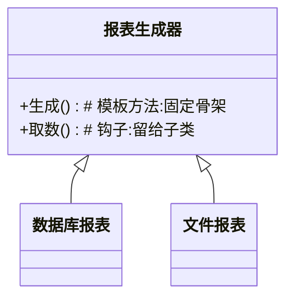

### 问题

一类流程骨架固定,但某些步骤各不相同:报表生成都是「取数 → 加工 → 渲染」,但取数有人读数据库有人读文件。
每个变体把骨架复制一遍再改几步——骨架改一处,所有变体跟着改一片。

### 思路

基类固定骨架(模板方法),把会变的步骤留成「钩子方法」;新变体 = 新子类,只填钩子,骨架一行不动。

### 结构



### 代码

```python
class ReportGenerator:
    def generate(self):            # 模板方法:骨架固定,不许重写
        rows = self.fetch()        # 变化点 → 钩子
        return self.render(rows)

    def fetch(self):               # 钩子:子类填
        raise NotImplementedError

class DbReport(ReportGenerator):
    def fetch(self):               # 新变体 = 新子类,只填钩子
        return db.query(...)
```

### 为什么有效

「不变的骨架」和「可变的步骤」分层:骨架收敛在基类,改一处全部生效;变体只能填钩子,想破坏骨架都破坏不了。
这是继承用对地方的少数场景之一。

### 代价

依赖继承,钩子一多基类变「钩子垃圾场」;钩子之间的隐含顺序(哪个先调)是隐性契约,文档不清就会踩雷。

### 与策略的区别

模板方法用继承:骨架在基类,变化点在子类(编译期定);策略用组合:行为对象运行期可换。
骨架固定步骤不同 → 模板方法;整个算法可换 → 策略。

### 什么时候用

流程骨架固定、步骤多变,且你想强制骨架不被破坏。
**反例**——骨架本身也经常变,继承会把改动放大到所有子类,改用组合(策略)。
