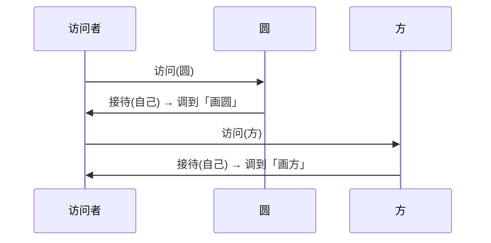

### 问题

一组稳定的元素类(编译器的语法树节点、文档的段落表格),要不停加新操作:导出、求值、校验、美化打印……
每加一种操作就要改所有元素类——而这些类是老代码,不许动;操作代码塞在元素类里也污染了它们的本职。

### 思路

操作外置成「访问者」对象;元素只留一个接待方法(接受访问),把自已交给访问者。
新操作 = 新访问者,元素类一行不改。

### 结构



### 代码

```python
class Circle:
    def accept(self, visitor):
        visitor.visit_circle(self)   # 接待:把自己交给访问者对应的重载

class ExportSvg:                   # 新操作 = 新访问者
    def visit_circle(self, c): ...
    def visit_square(self, s): ...

for shape in shapes:               # 元素类一行不改
    shape.accept(ExportSvg())
```

### 为什么有效

「元素类型 × 操作」的分派问题:语言一般只按接收者动态分派(单次),访问者用「元素调访问者、访问者再调对应重载」两次单分派,
拼出了按两边类型同时分派的效果——这是它存在的底层理由。

### 代价

**加元素类难**——多一种元素,所有访问者都要补一个重载(它只适合「类型稳定、操作常增」的场景,反过来就是灾难);
**破坏封装**——元素要把内部信息暴露给访问者;
**读代码绕**——控制流在元素和访问者之间来回跳。

### 与迭代器的区别

迭代器只管「走一遍」;访问者管「走的时候按类型做不同的事」。常见搭配:迭代器遍历树,访问者处理每个节点。

### 什么时候用

元素类型稳定、操作不断增加:编译器语法树(求值/打印/优化)、文档导出(多种格式)。
**反例**——元素类型经常新增,或操作只有一两种,直接写进元素类。
